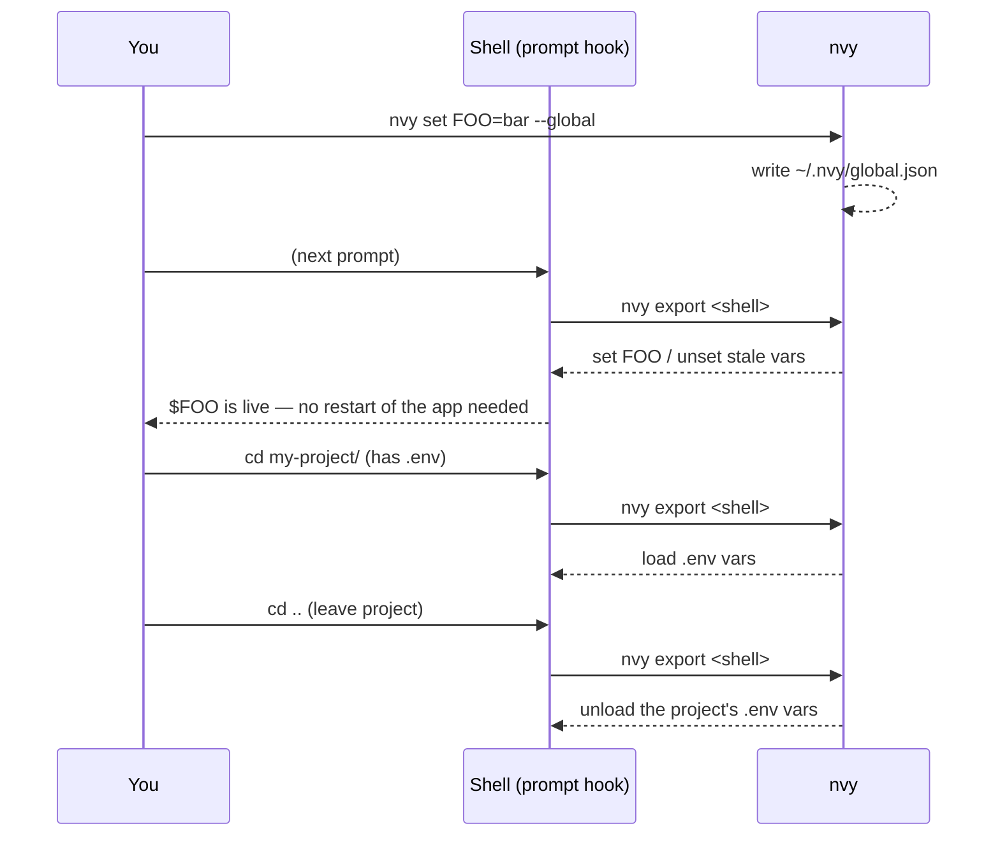

# nvy

**Environment variables that expire and remind you — offline, cross-platform, no cloud, no account.**

`nvy` manages environment variables at two scopes — **global** (user-wide) and **local** (per-project `.env`) — from one CLI. Set a variable with an expiration date and `nvy` notifies you before it dies. See every variable on your machine in one place, including the ones you set outside `nvy`. And it keeps `.env` files out of git for you.

> **nvy is not a secrets manager.** Values are stored in plaintext — there is no encryption at rest. For real secrets (production credentials, private keys) use a dedicated tool like [sops](https://github.com/getsops/sops), 1Password, or Vault. `nvy` is for the tokens, endpoints, and per-project config you juggle every day.

---

## Why nvy

- **Expiring tokens are invisible until they break.** A rotated PAT, a 90-day cloud key — you find out when a build fails. `nvy` tracks the expiry and fires a native desktop notification before it lapses. No offline CLI does this.
- **Your env vars are scattered.** Some live in your shell rc, some in Windows System Properties, some in a `.env`. `nvy list` shows all of them in one screen.
- **`.env` files leak.** Every local write checks `.gitignore` and adds `.env` / `.env.nvy` if missing.
- **Setting a global var and having it *actually be there*** — including for the shell you're standing in and the processes it spawns — is fiddly on every OS. `nvy` handles it with a shell hook.

---

## How it works

Two scopes, one precedence rule (**local overrides global**):

| Scope | Stored in | Metadata |
|-------|-----------|----------|
| `--global` | `~/.nvy/global.json` (+ Windows `HKCU\Environment`) | expiry, note — full |
| `--local` | `.env` in the current directory | in a `.env.nvy` sidecar, only if used |

A subprocess can't push environment into the shell that launched it, so `nvy` uses the [direnv](https://direnv.net/) model: `nvy init` installs a **prompt hook** that runs `nvy export` on every prompt and applies the result to the live shell.



Global vars appear on the next prompt; a project's `.env` loads when you enter its directory and **unloads when you leave**.

---

## Install

`nvy` ships signed binaries for Linux, macOS, and Windows (amd64 + arm64).

**Download a release binary** from the [releases page](https://github.com/AgusRdz/nvy/releases), then verify and install (Linux example):

```bash
gh attestation verify nvy-linux-amd64 --repo AgusRdz/nvy   # verify provenance (see Verification)
chmod +x nvy-linux-amd64
mv nvy-linux-amd64 ~/.local/bin/nvy
```

**With Go:**

```bash
go install github.com/AgusRdz/nvy@latest
```

**From source (Docker — no local Go toolchain needed):**

```bash
git clone https://github.com/AgusRdz/nvy && cd nvy
make install       # builds for your platform and installs the binary
```

Then wire the shell hook (once):

```bash
nvy init
```

Restart your shell or `source` your profile once; after that, `nvy` keeps your environment in sync automatically on every prompt.

> A one-line installer (`curl … | sh` / `irm … | iex`) with immediate activation, and an in-place `nvy update`, are on the roadmap.

> **macOS note:** a manually downloaded binary may be quarantined on first run. Clear it with `xattr -d com.apple.quarantine ./nvy`.

---

## Quick start

```bash
nvy set API_URL=https://api.dev        # global (default scope)
nvy set DB_PASSWORD=<value> --local    # writes ./.env (and enforces .gitignore)
nvy set CI_TOKEN=<token> --global --expires 2026-12-31 --note "CI token"
nvy get API_URL                        # read a value
nvy list                               # everything: global + local + external
nvy remove API_URL                     # delete
```

---

## Commands

```
nvy init                       Install the shell hook + register the daily expiration check
nvy set KEY=value [flags]      Set a variable
nvy get KEY [--global|--local] Print a variable's value
nvy remove KEY [scope]         Delete a variable
nvy list [--global|--local]    List variables (managed + external, expiry-aware)
nvy import KEY... | --all      Adopt external OS vars into nvy's global store
nvy path add|remove|list       Manage individual PATH entries
nvy check                      Scan for expiring vars and notify (run by the scheduler)
nvy ui                         Terminal UI
nvy version                    Print the version
```

`set` flags: `--global` (default) / `--local`, `--expires YYYY-MM-DD`, `--note TEXT`.

---

## Expiration & notifications

Tag any variable with an expiry:

```bash
nvy set AWS_SESSION_TOKEN=... --global --expires 2026-10-01 --note "prod sso"
```

`nvy init` registers a daily background task (Task Scheduler on Windows, launchd on macOS, cron on Linux) that runs `nvy check` and raises a native desktop notification for anything expired or expiring soon. `nvy list` flags them inline:

```
GLOBAL
  nvy  AWS_SESSION_TOKEN               updated 2026-09-21  ⚠ expires in 3 days  [prod sso]
```

---

## Reflect & import external variables

`nvy` sees the variables you set *outside* it — Windows `HKCU\Environment`, or exported vars on macOS/Linux — not just its own store. `nvy list` tags each one, and masks external values so secrets aren't printed:

```
GLOBAL
  nvy  API_URL                         updated 2026-09-21
  ext  API_TOKEN                       AbCd••••  (external, read-only)
```

Adopt an external var into `nvy` (so you can add an expiry or note to it):

```bash
nvy import GH_TOKEN        # adopt one
nvy import --all           # adopt everything external
```

`nvy` never modifies an external variable in place — it only reads it until you explicitly import it.

---

## PATH management

Add or remove individual PATH entries without ever rewriting the whole value:

```bash
nvy path add ~/.local/bin
nvy path remove /some/old/dir
nvy path list
```

On Windows this edits the user `PATH` in the registry (preserving `REG_EXPAND_SZ`); on macOS/Linux it goes through the shell hook.

---

## Verification

Every release binary carries a [SLSA build provenance attestation](https://docs.github.com/en/actions/security-guides/using-artifact-attestations-to-establish-provenance-for-builds) — cryptographic proof it was built from this repository at a specific commit. Verify with the [GitHub CLI](https://cli.github.com/):

```bash
gh attestation verify nvy-darwin-arm64 --repo AgusRdz/nvy
```

Release checksums are additionally signed with `nvy`'s Ed25519 key (`checksums.txt.sig`), and the matching public key is embedded in the binary.

---

## Development

No local Go toolchain required — everything runs in Docker:

```bash
make build             # build for your platform (in container)
make test              # go test ./...
make cross             # build all targets (linux/darwin/windows × amd64/arm64)
make install           # build + install to your platform's bin dir
make release-patch     # tag + push the next patch version (fires the release workflow)
```

Pushing a `v*` tag runs `.github/workflows/release.yml`: tests, cross-compile, checksums, Ed25519 signing, GitHub release with git-cliff notes, and build-provenance attestation.

---

## License

MIT
