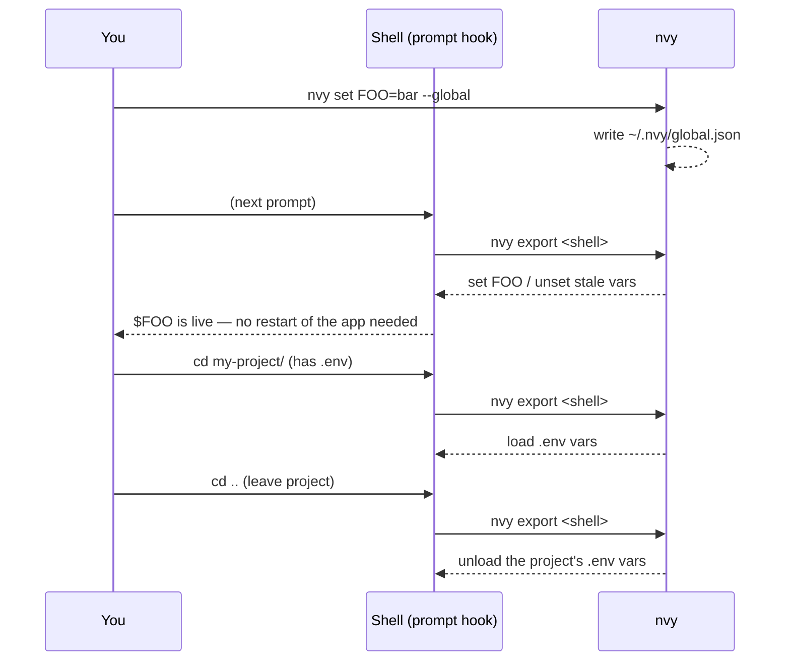

# nvy

**Environment variables that expire and remind you — offline, cross-platform, no cloud, no account.**

`nvy` manages environment variables at two scopes — **global** (user-wide) and **local** (per-project `.env`) — from one CLI. Set a variable with an expiration date and `nvy` notifies you before it dies. See every variable on your machine in one place, including the ones you set outside `nvy`. And it keeps `.env` files out of git for you.

> **nvy is not a secrets manager.** Values are stored in plaintext — there is no encryption at rest. For real secrets (production credentials, private keys) use a dedicated tool like [sops](https://github.com/getsops/sops), 1Password, or Vault. `nvy` is for the tokens, endpoints, and per-project config you juggle every day.

---

## Demo

`nvy ui` in action — expiry-colored keys (red once expired, yellow when close), the `[?]` help overlay, and the `[c]` settings screen:

<!--
  A recorded GIF is generated from demo.tape (see the Development section):

      make demo        # or: vhs demo.tape   →   writes docs/demo.gif

  Once docs/demo.gif exists, uncomment the line below (and drop the static
  mock underneath it if you prefer):

  
-->

```text
  nvy — environment variable manager
  ──────────────────────────────────────────────────────────────
    GLOBAL VARS
    ▸ AWS_SESSION_TOKEN    updated 2026-09-21   ⚠ expires in 3 days   [prod sso]
      API_URL              updated 2026-09-19
      GH_TOKEN             AbCd••••   (external, read-only)

    LOCAL VARS  (.env)
      DATABASE_URL         updated today
      OLD_TOKEN            ✗ expired 2026-09-18                       [rotate me]
      STRIPE_KEY           updated today   expires 2027-03-01

    PATH  (12)   ⏎ to expand
  ──────────────────────────────────────────────────────────────
    [↑↓] navigate   [←→] section   [n] new   [e] edit   [?] help   [q] quit
```

> Colors don't show in a code block — `AWS_SESSION_TOKEN` renders yellow (expiring soon), `OLD_TOKEN` red (expired). Press `[?]` for the full key reference.

---

## Why nvy

- **Expiring tokens are invisible until they break.** A rotated PAT, a 90-day cloud key — you find out when a build fails. `nvy` tracks the expiry and fires a native desktop notification before it lapses. No offline CLI does this.
- **Your env vars are scattered.** Some live in your shell rc, some in Windows System Properties, some in a `.env`. `nvy list` shows all of them in one screen.
- **`.env` files leak.** Every local write checks `.gitignore` and adds `.env` / `.env.nvy` if missing.
- **Setting a global var and having it *actually be there*** — including for the shell you're standing in and the processes it spawns — is fiddly on every OS. `nvy` handles it with a shell hook.

---

## How it works

Two scopes, one precedence rule (**local overrides global**):

| Scope | Stored in | Metadata |
|-------|-----------|----------|
| `--global` | `~/.nvy/global.json` (+ Windows `HKCU\Environment`) | expiry, note — full |
| `--local` | `.env` in the current directory | in a `.env.nvy` sidecar, only if used |

A subprocess can't push environment into the shell that launched it, so `nvy` uses the [direnv](https://direnv.net/) model: `nvy init` installs a **prompt hook** that runs `nvy export` on every prompt and applies the result to the live shell.



Global vars appear on the next prompt; a project's `.env` loads when you enter its directory and **unloads when you leave**.

---

## Install

`nvy` ships signed binaries for Linux, macOS, and Windows (amd64 + arm64). The installer downloads the right binary, verifies its SHA-256 checksum, installs the shell hook, and schedules the expiration check.

**macOS / Linux:**

```bash
curl -fsSL https://raw.githubusercontent.com/AgusRdz/nvy/main/install.sh | sh
```

Pin a version or change the install directory:

```bash
curl -fsSL https://raw.githubusercontent.com/AgusRdz/nvy/main/install.sh | NVY_VERSION=v0.1.6 sh
curl -fsSL https://raw.githubusercontent.com/AgusRdz/nvy/main/install.sh | NVY_INSTALL_DIR=/usr/local/bin sh
```

The binary goes to `~/.local/bin` by default; if that's not on your `PATH` the installer adds it to `~/.zshrc` or `~/.bashrc`. A piped installer runs in a child process and can't touch your running shell, so activate it once — `source ~/.zshrc` (or open a new shell). After that `nvy` syncs automatically on every prompt.

**Windows (PowerShell):**

```powershell
irm https://raw.githubusercontent.com/AgusRdz/nvy/main/install.ps1 | iex
```

Installs to `%LOCALAPPDATA%\Programs\nvy`, adds it to your user `PATH` (live in the current session via a `WM_SETTINGCHANGE` broadcast), and installs the prompt hook. Open a new shell — or run `. $PROFILE` — to activate the hook.

**With Go:**

```bash
go install github.com/AgusRdz/nvy@latest   # then run: nvy init
```

**From source (Docker — no local Go toolchain needed):**

```bash
git clone https://github.com/AgusRdz/nvy && cd nvy
make install       # builds for your platform and installs the binary; then: nvy init
```

**Manual download** — grab a binary from the [releases page](https://github.com/AgusRdz/nvy/releases), verify it (see [Verification](#verification)), then `chmod +x` and move it onto your `PATH`.

> Run `nvy update` to self-update in place — it fetches the latest release, verifies its signed checksum, and swaps the running binary. `nvy auto-update on` makes nvy check and stage updates automatically in the background (applied on your next command); `nvy auto-update off` (the default) just prints a hint on your next command when an update is available.

> **macOS note:** a manually downloaded binary may be quarantined on first run. Clear it with `xattr -d com.apple.quarantine ./nvy`. Installing via the script avoids this.

---

## Quick start

```bash
nvy set API_URL=https://api.dev        # global (default scope)
nvy set DB_PASSWORD=<value> --local    # writes ./.env (and enforces .gitignore)
nvy set CI_TOKEN=<token> --global --expires 2026-12-31 --note "CI token"
nvy get API_URL                        # read a value
nvy list                               # everything: global + local + external
nvy remove API_URL                     # delete
```

---

## Commands

```
nvy init                       Install the shell hook, shell completions, + register the expiration check schedule
nvy set KEY[=value] [flags]    Set a variable, or (bare KEY) stamp its expiry/note
nvy get KEY [--global|--local] Print a variable's value
nvy remove KEY [scope]         Delete a variable
nvy list [--global|--local|--path] [--all]
                                List variables (managed + external, expiry-aware);
                                hidden entries are omitted unless --all is passed
nvy hide <name> [--local|--path]
                                Hide an entry from the default list/ui view
nvy unhide <name> [--local|--path]
                                Reveal a previously hidden entry
nvy import KEY... | --all      Adopt external OS vars into nvy's global store
nvy path add|remove|list       Manage individual PATH entries
nvy check                      Scan for expiring vars and notify (run by the scheduler)
nvy ui                         Terminal UI
nvy config [set|edit]          Show or change nvy settings
nvy doctor                     Diagnose the install (hook, task, PATH, store, .gitignore)
nvy update                     Self-update to the latest signed release
nvy auto-update on|off         Toggle background auto-updates (off by default)
nvy uninstall [--keep-data]    Remove the hook, completions, background task, data, and binary
nvy version                    Print the version
```

`set` flags: `--global` (default) / `--local`, `--expires YYYY-MM-DD` (or `none` to clear), `--note TEXT`. Pass a **bare `KEY`** with `--expires`/`--note` (no `=value`) to stamp metadata on an existing or external var without retyping its value.

---

## Expiration & notifications

Tag any variable with an expiry:

```bash
nvy set AWS_SESSION_TOKEN=... --global --expires 2026-10-01 --note "prod sso"
```

`nvy init` also generates shell completions (PowerShell, bash, or zsh, detected automatically) under `~/.nvy` and wires them into your profile — nothing to run or source by hand, and `KEY` arguments to `get`/`remove`/`hide`/`unhide`/`import` tab-complete against your actual variables.

`nvy init` registers a background task (Task Scheduler on Windows, launchd on macOS, cron on Linux) that runs `nvy check` about **every 4 hours** — plus at login and with catch-up-after-downtime on macOS/Linux (those extra triggers need admin on Windows, so it stays every-4h there). Re-run `nvy init` after upgrading `nvy` to pick up schedule changes. It raises a native desktop notification for anything expired or expiring soon: "expires today", "expires tomorrow", "expires in N days", or "has already expired" once past due — at most **once per calendar day per variable**, so the frequent schedule doesn't re-toast the same var. `nvy list` flags them inline:

```
GLOBAL
  nvy  AWS_SESSION_TOKEN               updated 2026-09-21  ⚠ expires in 3 days  [prod sso]
```

Add or change an expiry on a variable you already have — including an external one — without retyping its value:

```bash
nvy set API_TOKEN --global --expires 2026-12-31   # adopts external / updates managed; value untouched
nvy set API_TOKEN --global --expires none         # clear it
```

In `nvy ui`, press `[x]` on a variable to set or clear its expiry, and `[t]` to set or clear its **note** (blank clears it) — external vars are imported first for both. The note shows in magenta brackets at the end of the row. Keys are colored by urgency too — red once expired, yellow inside the lead-days window.

Notifications are on by default; turn them off without touching the scheduled task:

```bash
nvy config set notifications-enabled false
nvy config set notifications-enabled true
```

With them off, `nvy check` prints `nvy: notifications disabled` and exits cleanly — no toast/notify call is made. The `nvy ui` settings screen (`[c]`) has the same toggle on its `Notifications` field (`space`/`enter`/`←`/`→`).

---

## Reflect & import external variables

`nvy` sees the variables you set *outside* it — Windows `HKCU\Environment`, or exported vars on macOS/Linux — not just its own store. `nvy list` tags each one, and masks external values so secrets aren't printed:

```
GLOBAL
  nvy  API_URL                         updated 2026-09-21
  ext  API_TOKEN                       AbCd••••  (external, read-only)
```

Adopt an external var into `nvy` (so you can add an expiry or note to it):

```bash
nvy import GH_TOKEN        # adopt one
nvy import --all           # adopt everything external
```

`nvy` never modifies an external variable in place — it only reads it until you explicitly import it.

---

## PATH management

Add or remove individual PATH entries without ever rewriting the whole value:

```bash
nvy path add ~/.local/bin
nvy path remove /some/old/dir
nvy path list
```

On Windows this edits the user `PATH` in the registry (preserving `REG_EXPAND_SZ`); on macOS/Linux it adds or removes a tagged `export PATH="$PATH:…"  # nvy-path` line in your shell config (`~/.zshrc` / `~/.bashrc`) — reload the shell or open a new one to pick it up.

---

## Copy to clipboard

In `nvy ui`, press `[y]` on the selected entry to copy it to the clipboard: `KEY=VALUE` (the real value, not the masked preview) for a GLOBAL/LOCAL var, or the raw entry for a PATH row. Uses `clip.exe` on Windows, `pbcopy` on macOS, and `wl-copy`/`xclip` (whichever is found) on Linux — no extra dependency.

---

## Hiding entries

Rarely-used globals, local vars, and PATH entries clutter `nvy list` / `nvy ui`. Mark them hidden to omit them by default — this is display-only, it never touches the actual variable or PATH:

```bash
nvy hide OLD_TOKEN                 # global (default scope)
nvy hide DEBUG --local             # local .env var
nvy hide /some/old/dir --path      # PATH entry

nvy list                           # OLD_TOKEN etc. omitted, with a "(N hidden — use --all)" note
nvy list --all                     # shows everything, hidden entries tagged (hidden)

nvy unhide OLD_TOKEN                # bring it back
```

In `nvy ui`, press `[h]` to toggle hidden on the selected entry and `[H]` to reveal hidden entries for the session.

---

## Collapsible TUI sections

Config-driven: `collapsed-sections` lists which `nvy ui` sections (`global`, `local`, `path`) start collapsed (header only, rows hidden):

```bash
nvy config set collapsed-sections path        # start with PATH collapsed
nvy config set collapsed-sections path,local  # multiple sections
nvy config set collapsed-sections none        # clear it (all start expanded)
nvy config                                     # collapsed-sections = path,local
```

In `nvy ui`, press `[⏎]` (Enter) on the focused section to toggle it collapsed/expanded for the current session — this never rewrites the config.

## Settings screen

Rather than remembering config keys, press `[c]` in `nvy ui` to open a settings screen: adjust `notification-lead-days` with `←`/`→`, toggle the per-section collapse defaults with `space`/`←`/`→`, and toggle `notifications-enabled` the same way. Changes save to `~/.nvy/config.json` immediately. `nvy config edit` (opens `$EDITOR`) and `nvy config set` remain as fallbacks.

---

## Verification

Every release binary carries a [SLSA build provenance attestation](https://docs.github.com/en/actions/security-guides/using-artifact-attestations-to-establish-provenance-for-builds) — cryptographic proof it was built from this repository at a specific commit. Verify with the [GitHub CLI](https://cli.github.com/):

```bash
gh attestation verify nvy-darwin-arm64 --repo AgusRdz/nvy
```

Release checksums are additionally signed with `nvy`'s Ed25519 key (`checksums.txt.sig`), and the matching public key is embedded in the binary.

---

## Development

No local Go toolchain required — everything runs in Docker:

```bash
make build             # build for your platform (in container)
make test              # go test ./...
make cross             # build all targets (linux/darwin/windows × amd64/arm64)
make install           # build + install to your platform's bin dir
make demo              # render docs/demo.gif from demo.tape (needs vhs on the host)
make release-patch     # tag + push the next patch version (fires the release workflow)
```

The demo GIF is scripted in [`demo.tape`](demo.tape) and rendered with [vhs](https://github.com/charmbracelet/vhs) — `make demo` (or `vhs demo.tape`) runs a sandboxed `nvy ui` session in a throwaway temp dir and writes `docs/demo.gif`. It runs on the host, not in Docker, because vhs needs a PTY. Bump the hardcoded expiry dates in the tape to a few upcoming days first, so the red/yellow coloring shows.

Pushing a `v*` tag runs `.github/workflows/release.yml`: tests, cross-compile, checksums, Ed25519 signing, GitHub release with git-cliff notes, and build-provenance attestation.

---

## License

MIT
